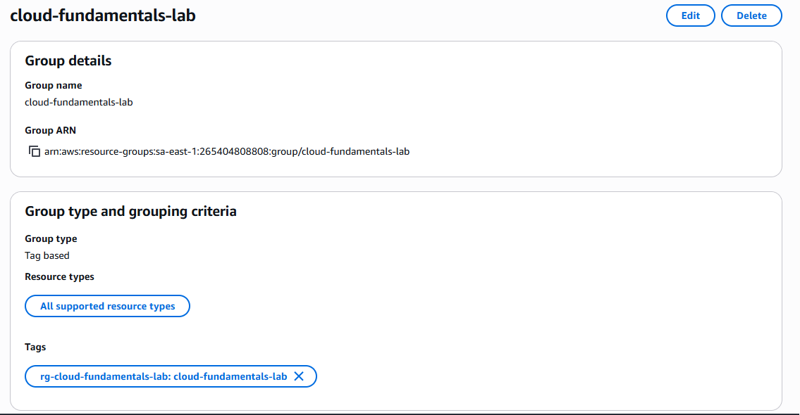
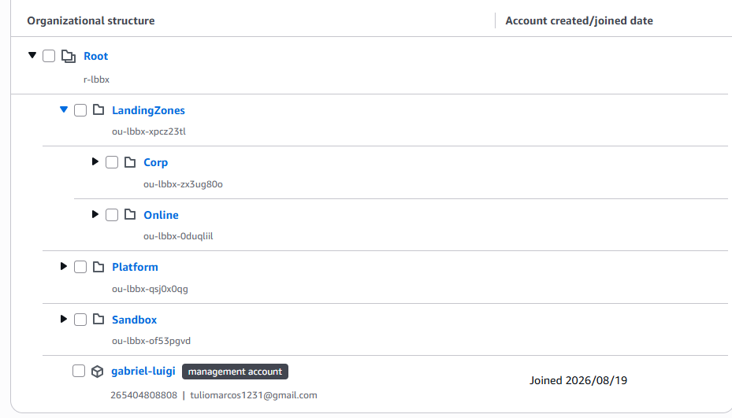
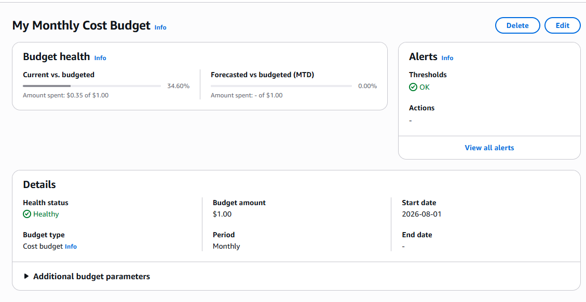
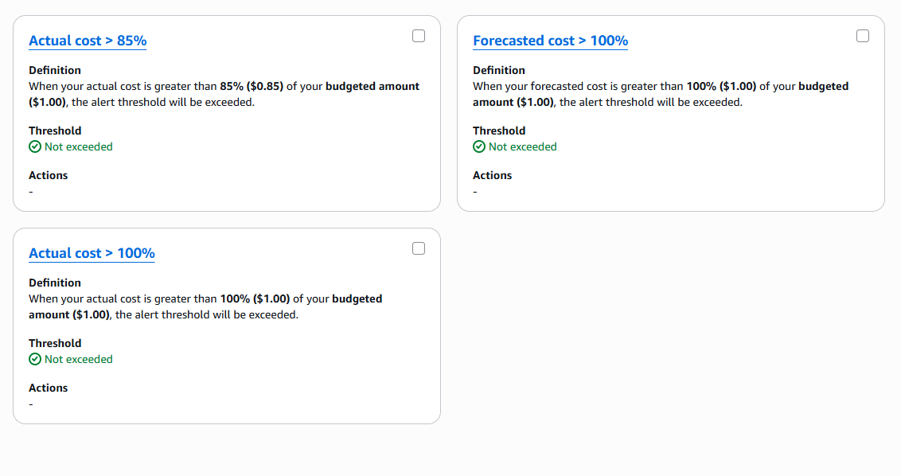

# aws-resource-groups-and-organizations

Simulating AWS resource governance for a multi-department company using Resource Groups, Organizations, and Cost Budgets.

## Objective

Demonstrate a practical AWS governance setup, applying resource tagging, organizational hierarchy, and cost control - concepts commonly required in Cloud and FinOps roles.

## Enviroment

Amazon AWS Resource Groups & Tag Editor
Amazon AWS Organizations 
Amazon AWS Billing and Cost Management

## Governance Structure
Root
├── LandingZones
│ ├── Corp
│ └── Online
├── Platform
└── Sandbox

## Key Configuration

- Resource Group: `rg-cloud-fundamentals-lab`, tag `project = cloud-fundamentals-lab`
- Organizational Units created under AWS Organizations to represent department separation
- Monthly cost budget: limit US$ 1.00, alerts at 85% and 100%

## Evidence

### 1. Creating Resource Group with tag key and value

### 2. Creating Organization Group and organization structure

### 3. Creating Monthly Cost Budget with alerts (85% & 100%)

## Notes
- This project simulates a simplified AWS Organizations governance structure (Platform, LandingZones with Corp/Online, and Sandbox) for a hypothetical multi-department company.
- Since this AWS account has only one member, cross-account movement between OUs was not tested — the OU hierarchy demonstrates the governance design pattern rather than a full multi-account deployment.
- Monthly cost budget was configured as a FinOps safety measure before creating any billable resource.
